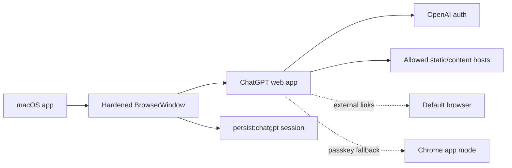

# ChatGPT Wrapper

<p align="center">
  <strong>A quiet macOS shell for ChatGPT.</strong><br>
  Hardened Electron, TypeScript, persistent login, and a practical escape hatch for passkey-heavy auth.
</p>

<p align="center">
  <a href="#why">Why</a> ·
  <a href="#design">Design</a> ·
  <a href="#run">Run</a> ·
  <a href="#package">Package</a> ·
  <a href="#auth-fallback">Auth Fallback</a>
</p>

---

## Why

This project is intentionally small. It is not a ChatGPT clone, not an API client, and not a browser extension. It is a desktop wrapper around the real ChatGPT web app, built so the operating surface stays easy to inspect.

The core idea is simple:



## Design

| Principle | Implementation |
| --- | --- |
| Thin wrapper | Loads `https://chat.openai.com/` and follows current ChatGPT redirects. |
| No webview | Uses Electron `BrowserWindow`; no `<webview>` tag. |
| Session isolation | Stores site state in `persist:chatgpt`, separate from other Electron sessions. |
| No token handling | Does not copy, export, scrape, or write auth tokens/cookies into custom files. |
| Least privilege | Keeps `sandbox`, `contextIsolation`, and `webSecurity` enabled with Node disabled in remote content. |
| Link boundaries | Keeps OpenAI/auth/static hosts in-app and sends unrelated links to the system browser. |
| Passkey realism | Strips Electron from the user agent and includes a Chrome app-mode fallback for Google passkey loops. |

## Run

```bash
npm install
npm run build
npm start
```

## Package

Unsigned local macOS builds:

```bash
npm run dist:mac:arm64:unsigned
npm run dist:mac:x64:unsigned
npm run dist:mac:universal:unsigned
```

Artifacts are written to `release/`, which is intentionally ignored by Git.

Signed/notarized builds use the standard scripts after Apple credentials are available:

```bash
export APPLE_ID="your-apple-id@example.com"
export APPLE_APP_SPECIFIC_PASSWORD="xxxx-xxxx-xxxx-xxxx"
export APPLE_TEAM_ID="YOURTEAMID"

npm run dist:mac:arm64
npm run dist:mac:x64
npm run dist:mac:universal
```

If credentials are absent, `build/notarize.cjs` skips notarization cleanly.

## Auth Fallback

Google passkeys can fail inside embedded Chromium/Electron contexts even when the same account works in Chrome or Safari. If Google gets stuck on "Complete sign-in using your passkey," use:

```text
ChatGPT Wrapper -> Open in Chrome App Mode
```

That opens ChatGPT in a Chrome app-style window backed by your normal Chrome profile, where existing passkeys and MFA methods are most likely to work.

## Security Checks

```bash
npm run build
rg -n "<webview\\b|webviewTag\\s*:\\s*true" src/main.ts
rg -n "setCookie|getCookie|getAllCookies|Authorization|Bearer|localStorage|sessionStorage|token" src/main.ts
```

The first command should pass. The two `rg` checks should not find implementation hits that indicate webview use or custom token handling.

## Repository Shape

```text
src/main.ts                  Electron main process
build/notarize.cjs           Optional notarization hook
build/entitlements.mac.plist macOS hardened runtime entitlements
SECURITY-AUDIT-CHECKLIST.md  Review checklist and validation notes
```

Generated folders such as `dist/`, `release/`, and `node_modules/` are intentionally excluded from Git.
