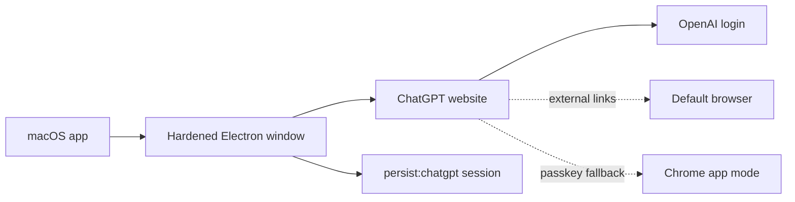

# ChatGPT Wrapper

<p align="center">
  <strong>A small macOS wrapper for the ChatGPT website.</strong><br>
  TypeScript, Electron, persistent login, and no API key required.
</p>

<p align="center">
  <a href="#what-it-is">What it is</a> ·
  <a href="#how-it-works">How it works</a> ·
  <a href="#run-it">Run it</a> ·
  <a href="#package-it">Package it</a> ·
  <a href="#license">License</a>
</p>

---

## What it is

ChatGPT Wrapper is a lightweight desktop shell for the real ChatGPT web app. It opens ChatGPT in a macOS window, keeps the code easy to inspect, and avoids extra product surface that would make the app harder to trust.

It does not call the OpenAI API, clone ChatGPT, add analytics, or handle tokens directly.



## How it works

| Area | Choice |
| --- | --- |
| App shell | Electron `BrowserWindow`, not `<webview>` |
| Language | TypeScript |
| Build | Local TypeScript transpile script |
| Login persistence | Dedicated `persist:chatgpt` Electron session |
| Token handling | No custom cookie, token, or local storage copying |
| Security defaults | Sandbox on, context isolation on, Node off for web content |
| Links | OpenAI/auth pages stay in-app; unrelated links open in the browser |
| Passkeys | Chrome app-mode fallback for Google/passkey flows that do not like Electron |

## Run it

```bash
npm install
npm run build
npm start
```

## Package it

Unsigned local macOS builds:

```bash
npm run dist:mac:arm64:unsigned
npm run dist:mac:x64:unsigned
npm run dist:mac:universal:unsigned
```

Build output goes to `release/`, which is ignored by Git.

Packaging does not install or replace `/Applications/ChatGPT Wrapper.app`. If an older copy is already installed there, it can be stale relative to this source tree until you replace it manually with a package from `release/`.

For a bounded packaging diagnostic that avoids DMG/ZIP creation and stops instead of hanging indefinitely:

```bash
npm run package:diagnose
```

The diagnostic package script writes only generated output under `release/` and never mutates `/Applications`. It disables Electron Builder's update notifier so packaging startup does not depend on an npm registry check. If Electron Builder does not complete before the timeout, the script exits `124` and the local packaging problem is still present.

Signed and notarized builds use the regular packaging scripts once Apple credentials are available:

```bash
export APPLE_ID="your-apple-id@example.com"
export APPLE_APP_SPECIFIC_PASSWORD="xxxx-xxxx-xxxx-xxxx"
export APPLE_TEAM_ID="YOURTEAMID"

npm run dist:mac:arm64
npm run dist:mac:x64
npm run dist:mac:universal
```

If those variables are missing, the notarization hook skips cleanly.

## Passkey note

Some Google passkey flows do not work well inside Electron, even when the same account works in a regular browser. For that case, the app menu includes:

```text
Open in Chrome App Mode
```

That opens ChatGPT in a Chrome app-style window backed by the normal Chrome profile.

## Security checks

```bash
npm run build
npm run security:check
```

Both commands should pass. The security check verifies the expected hardened window posture and fails if `<webview>`, custom cookie/token/storage handling, analytics-like code, or packaging metadata drift appears in the source.

## License

Released under [The Unlicense](LICENSE). Use it however you like.
